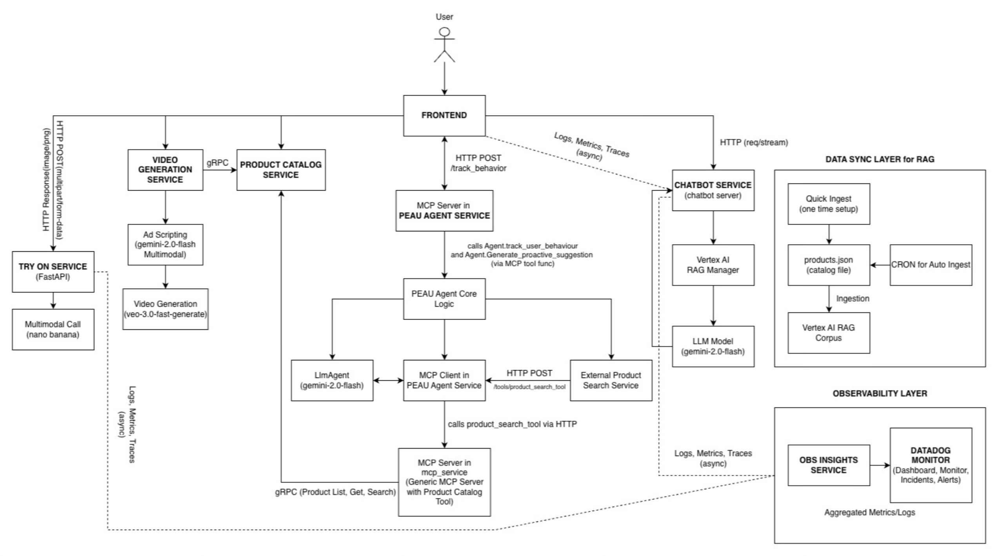

# V-Commerce Studio

A cloud-native microservices demo application showcasing modern e-commerce patterns with **AI-powered features** and **comprehensive LLM Observability**, deployed on **Google Kubernetes Engine (GKE)** and built for production cloud-native environments.

**🏆 Built for AI Partner Catalyst Hackathon**  
**☁️ Live on GKE:** [vcommercestudio.xyz](https://vcommercestudio.xyz) (prefereably use Edge or Firefox to access the site if Chrome doesn't work)

[](https://www.datadoghq.com/)
[](https://kubernetes.io/)
[](https://ai.google.dev/)

---

## 🎯 What Makes This Special

V-Commerce isn't just another microservices demo—it's a **fully AI-native e-commerce platform** where every customer interaction touches AI:

| Feature | AI Service | What It Does |
|---------|------------|--------------|
| 💬 **Chat Shopping** | Chatbot Service | Natural language product search and recommendations |
| 👗 **AI Stylist** | PEAU Agent | Proactive engagement with personalized suggestions |
| 🪞 **Virtual Try-On** | Try-On Service | AI-generated product visualizations on user photos |
| 🎬 **Product Videos** | Video Generation | AI-generated marketing videos (try using vcommercestudio.xyz/admin) |

**But building AI features is only half the battle—observing them is the other half.**

This project demonstrates a **production-grade LLM observability strategy** with:
- 🔐 **Attacker attribution** (not just detection)
- 📊 **Business metrics** as observability signals
- 🤖 **AI observing AI** (predictive failure detection)
- 🖼️ **Multimodal security** monitoring

---

## 🏗️ Architecture



<details>
<summary><b>📋 Core Services</b></summary>

| Service | Language | Description |
|---------|----------|-------------|
| **Frontend** | Go | Web frontend serving the user interface |
| **Product Catalog** | Go | Manages product inventory and search |
| **Cart** | Python | Shopping cart management |
| **Checkout** | Go | Orchestrates the checkout process |
| **Shipping** | Go | Handles shipping quotes and order shipments |
| **Payment** | Node.js | Processes payment transactions |
| **Currency** | Node.js | Currency conversion service |
| **Email** | Python | Sends order confirmation emails |
| **Ad** | Python | Contextual advertisement service |
| **Recommendation** | Python | Product recommendation engine |

</details>

<details>
<summary><b>🤖 AI-Powered Services</b></summary>

| Service | Language | Model | Description |
|---------|----------|-------|-------------|
| **Chatbot** | Python | Gemini 2.0 Flash | AI shopping assistant with RAG |
| **PEAU Agent** | Python | Gemini 2.0 Flash | Proactive engagement AI stylist |
| **Try-On** | Python | Gemini 2.0 Flash Image | Virtual product try-on with image generation |
| **Video Generation** | Python | Veo 3 | AI-generated product videos |
| **Observability Insights** | Python | Gemini | AI-powered metric analysis and failure prediction |

</details>

<details>
<summary><b>📡 Observability Stack</b></summary>

| Component | Purpose |
|-----------|---------|
| **Datadog Agent** | Infrastructure and application monitoring |
| **DogStatsD** | Custom metrics emission |
| **APM Traces** | Distributed tracing across all services |
| **LLM Observability** | Token usage, costs, and quality tracking |
| **Custom Monitors** | 5 detection rules for AI-specific issues |
| **Incident Management** | Auto-created incidents with attacker attribution |

</details>

---

## 🔍 LLM Observability Strategy

> **Read the full strategy:** [docs/DETECTION_RULES.md](docs/DETECTION_RULES.md)

### The Challenge

Traditional monitoring asks: *"Is the service up?"*

For AI applications, we need to ask:
- *"Is the AI actually helping users buy things?"*
- *"Who is attacking us, not just what attacks are happening?"*
- *"Will we fail in 2 hours based on current patterns?"*

### Our 5 Detection Rules

| # | Rule | Metric | Innovation |
|---|------|--------|------------|
| 1 | **Prompt Injection** | `llm.security.injection_attempt_score by {session_id}` | Tracks attackers by session, auto-creates incidents |
| 2 | **Interactions-Per-Conversion** | `llm.cost_per_conversion` | Business outcome metric, not just uptime |
| 3 | **Quality Degradation** | `llm.response.quality_score` | Catches gradual decay before users complain |
| 4 | **Predictive Capacity** | `llm.prediction.error_probability` | AI predicts failures 2 hours in advance |
| 5 | **Multimodal Security** | `tryon.security.* by {user_id}` | Tracks image-based attackers by user ID |

### Incident Auto-Creation

Two monitors automatically create incidents with **attacker identification**:

| Monitor | Attacker Tracking | Incident Handle |
|---------|-------------------|-----------------|
| Prompt Injection | `{{session_id.name}}` | `@incident-prompt-injection` |
| Multimodal Attack | `{{user_id.name}}` | `@incident-multimodal` |

> **Runbooks:** [docs/RUNBOOKS.md](docs/RUNBOOKS.md)

---

## 🚀 Quick Start

### Prerequisites

- Docker Desktop, Minikube, or Kind
- kubectl
- Skaffold 2.0.2+
- Datadog Account ([sign up free](https://www.datadoghq.com/))

### Deploy Locally

```bash
# Clone the repository
git clone https://github.com/mvp-ing/v-commerce-studio.git
cd v-commerce-studio

# Start local Kubernetes cluster
minikube start --cpus=4 --memory 4096 --disk-size 32g

# Deploy all services
skaffold run

# Port forward to access frontend
kubectl port-forward deployment/frontend 8080:8080
```

Open http://localhost:8080

### Deploy to Google Kubernetes Engine (GKE)

```bash
# Set your GCP project
export PROJECT_ID=your-gcp-project
export REGION=us-central1

# Create GKE Autopilot cluster
gcloud container clusters create-auto v-commerce-studio \
  --region=${REGION} \
  --project=${PROJECT_ID}

# Get credentials
gcloud container clusters get-credentials v-commerce-studio \
  --region=${REGION} \
  --project=${PROJECT_ID}

# Create namespace
kubectl create namespace v-commerce-studio
kubectl config set-context --current --namespace=v-commerce-studio

# Create secrets (replace with your actual API keys)
# Try-On Service (virtual try-on feature)
kubectl create secret generic tryonservice-secrets \
  --from-literal=GEMINI_API_KEY='your-gemini-api-key'

# Video Generation Service (AI-generated videos)
kubectl create secret generic video-generation-secrets \
  --from-literal=GEMINI_API_KEY='your-gemini-api-key'

# GCP Service Account credentials (for Vertex AI services)
# First, download your service account key from GCP Console as key.json
kubectl create secret generic gcp-credentials \
  --from-file=key.json=path/to/your/key.json

# Deploy with Cloud Build
skaffold run -p gcb \
  --default-repo=${REGION}-docker.pkg.dev/${PROJECT_ID}/v-commerce-studio \
  --namespace=v-commerce-studio
```

> **Note:** The application is currently running on GKE at [vcommercestudio.xyz](https://vcommercestudio.xyz)

### Enable Datadog Observability

```bash
# Configure Datadog credentials
cp docs/env.datadog.example .env.datadog
# Edit .env.datadog with your DD_API_KEY and DD_SITE

# Deploy Datadog dashboards and monitors
source .env.datadog
python3 scripts/create-datadog-dashboard.py
python3 scripts/create-datadog-monitors.py
```

---

## 🧪 Testing Detection Rules

### Generate Traffic

```bash
# Normal traffic
python3 scripts/traffic-generator.py --base-url http://localhost:8080

# Test prompt injection detection (triggers incident)
python3 scripts/traffic-generator.py --scenario prompt_injection

# Test multimodal attack detection (triggers incident)
kubectl port-forward svc/tryonservice 8082:8080
python3 scripts/traffic-generator.py --scenario multimodal_attack --tryon-url http://localhost:8082
```

### What to Expect

1. **Prompt Injection:** All attacks come from a single `session_id` → triggers incident with attacker ID
2. **Multimodal Attack:** All attacks come from a single `user_id` → triggers incident with attacker ID
3. **Datadog Dashboard:** See metrics populate in the LLM Observability Dashboard

---

## 📁 Project Structure

```
v-commerce-studio/
├── src/                          # Microservices source code
│   ├── frontend/                 # Go web frontend
│   ├── chatbotservice/           # AI chatbot with RAG
│   ├── peau_agent/               # AI stylist agent
│   ├── tryonservice/             # Virtual try-on service
│   └── ...                       # Other services
├── scripts/
│   ├── traffic-generator.py      # Generate traffic & test attacks
│   ├── create-datadog-dashboard.py
│   ├── create-datadog-monitors.py
│   └── obs-agent-test-runner.py  # Test observability insights
├── datadog-exports/
│   ├── dashboards/               # Dashboard JSON exports
│   ├── monitors/                 # Monitor JSON exports
│   └── incident-rules.json       # Incident configuration
├── docs/
│   ├── DETECTION_RULES.md        # LLM observability strategy
│   ├── RUNBOOKS.md               # Operational runbooks
│   └── INCIDENT_MANAGEMENT.md    # Incident procedures
└── kubernetes-manifests/         # K8s deployment files
```

---

## 📚 Documentation

| Document | Description |
|----------|-------------|
| [Detection Rules Strategy](docs/DETECTION_RULES.md) | Our LLM observability philosophy and innovation |
| [Runbooks](docs/RUNBOOKS.md) | Operational procedures for each detection rule |
| [Incident Management](docs/INCIDENT_MANAGEMENT.md) | How incidents are auto-created and managed |
| [Development Guide](docs/development-guide.md) | Building and running locally |

---

## 🛠️ Technology Stack

<details>
<summary><b>Languages & Frameworks</b></summary>

- **Go** - Frontend, Product Catalog, Checkout, Shipping
- **Python** - Cart, Email, Ad, Recommendation, AI services
- **Node.js** - Payment, Currency

</details>

<details>
<summary><b>AI/ML</b></summary>

**Models:**
- **Gemini 2.0 Flash** - Chat and conversational AI (chatbot service)
- **Gemini 2.0 Flash Image** - Virtual try-on feature with image generation
- **Veo 3** - AI-generated product advertisements and marketing videos
- **Vertex AI RAG Engine** - Retrieval Augmented Generation with product corpus

**Agent Creation Libraries:**
- **ADK (Agent Development Kit)** - Framework for building AI agents
- **MCP (Model Context Protocol)** - Agent orchestration and communication

</details>

<details>
<summary><b>Observability (Datadog)</b></summary>

- **Datadog APM** - Distributed tracing
- **Datadog LLM Observability** - Token, cost, and quality tracking
- **Datadog Monitors** - 5 custom detection rules
- **Datadog Incidents** - Auto-created with attacker attribution
- **DogStatsD** - Custom metrics emission
- **ddtrace** - Python automatic instrumentation

</details>

<details>
<summary><b>Infrastructure</b></summary>

- **Google Kubernetes Engine (GKE Autopilot)** - Production Kubernetes cluster
- **Google Artifact Registry** - Container image storage
- **Kubernetes** - Container orchestration
- **Docker** - Containerization
- **gRPC** - Inter-service communication
- **Skaffold** - Local development and deployment
- **Cloud Build** - CI/CD for GKE deployments

</details>

---

##  License

See [LICENSE](LICENSE) file for details.

---

**Built with ❤️ for the AI Partner Catalyst Hackathon**
